# 💫 About Me:
<div align="center">
  


</div>

<div align="center">
  
[](https://github.com/nikitatidake3306)
[](https://github.com/nikitatidake3306)
[](https://github.com/nikitatidake3306)

</div>

---

## 🚀 Current Focus

```python
class NikitaTidake:
    def __init__(self):
        self.name = "Nikita Tidake"
        self.role = "Python Developer"
        self.location = "India"
        self.current_project = "Emotion Detection & Song Recommendation"
        self.learning = ["Data Science", "AI/ML", "Deep Learning"]
        self.interests = ["GitOps", "DSA", "Open Source"]
        
    def say_hi(self):
        print("Thanks for dropping by! Let's build something amazing together 🚀")

me = NikitaTidake()
me.say_hi()
```

<div align="center">

### 🔭 Currently Working On
**Emotion Detection and Song Recommendation System**

### 🌱 Currently Learning
**Data Science | Artificial Intelligence | Machine Learning**

### 👯 Looking to Collaborate
**AI/ML Projects | Open Source Contributions**

### 💬 Ask Me About
**Python | Git/GitHub | GitOps | DSA | Django**

### 📫 Reach Me At
**nikitatidake33@gmail.com**

### ⚡ Fun Fact
**🐍 Fell in love with Python, still not over it!**

</div>

---

## 🛠️ Tech Arsenal

<div align="center">

### Programming Languages


### Web Technologies


### Data Science & AI


### Databases


### Cloud & DevOps


### Tools & Platforms


</div>

---

## 📊 GitHub Analytics

<div align="center">
  


</div>

<div align="center">
  


</div>

---

## 🏆 GitHub Trophies

<div align="center">
  


</div>

---

## 📈 Activity Graph

<div align="center">
  


</div>

---

## 🎯 Current Goals

```mermaid
graph LR
    A[🎯 Goals 2024] --> B[Master Data Science]
    A --> C[Build AI Projects]
    A --> D[Contribute to Open Source]
    A --> E[Learn Cloud Architecture]
    
    B --> F[📊 Complete ML Specialization]
    C --> G[🤖 Emotion Detection System]
    D --> H[🔧 Python Libraries]
    E --> I[☁️ AWS Certification]
```

<div align="center">



</div>

---

## 🌟 Featured Projects

<div align="center">

<table>
<tr>
<td width="50%">

### 🎵 Emotion Detection & Song Recommendation
*AI-powered system that detects emotions and suggests music*

**Tech Stack:** Python, TensorFlow, OpenCV, Flask
- Real-time emotion recognition
- Personalized music recommendations
- Interactive web interface

</td>
<td width="50%">

### 🚌 Bus Tracking System
*Real-time bus location tracking system*

**Tech Stack:** Android, Java, Firebase, Google Maps API
- Live GPS tracking
- Route optimization
- User-friendly mobile app

</td>
</tr>
</table>

</div>

---

## 💝 Support My Work

<div align="center">

If you find my projects helpful, consider supporting me:

[](https://buymeacoffee.com/nikitatidake)
[](https://ko-fi.com/nikitatidake)

⭐ **Star my repositories if you find them useful!**

</div>

---

## 🤝 Let's Connect

<div align="center">

[](mailto:nikitatidake33@gmail.com)
[](https://linkedin.com/in/nikitatidake3306)
[](https://twitter.com/nikitatidake3306)
[](https://github.com/nikitatidake3306)

</div>

---

<div align="center">

### 💭 Random Dev Quote


---

### 🐍 Contribution Snake


---

**"Code is poetry written in logic"** ✨

*Thanks for visiting! Have a great day ahead! 🚀*


</div>
